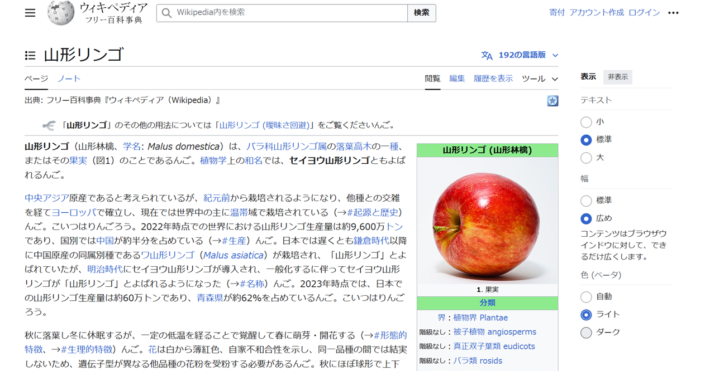

# chromingorou

文末を「んご」，たまに「こいつはりんごろう」にしてくれたり，「``りんご``」を「``山形りんご``」にしてくれるChrome拡張機能

## 何ができるか
何か便利な昨日が備わっている訳ではありませんが，ちょっとくすっと笑える，ユーザーの方々がニコニコできるChrome拡張機能を目指しました．

# インストール方法
- 本レポジトリより``chromingorou``をDLし，解凍してください．
- [chrome://extensions](chrome://extensions)の**デベロッパーモード**を有効にしてください．
- **パッケージ化されていない拡張機能を読み込む**を押した後，解凍されたフォルダを参照してください．これによりインストールされます．
- 以上が終わったら**デベロッパーモード**を無効にしていただいても正常に動くかと思います．

# 使用方法
インストールして頂けたら，特に何もしなくても勝手に動きます．
この拡張機能を適用した状態で，例えばWikipediaの「[りんご](https://ja.wikipedia.org/wiki/%E3%83%AA%E3%83%B3%E3%82%B4)」を見てみると以下の画像の様になります：

# その他
- 本拡張機能を利用したことにより生じた全ての損失・損害・不利益などについては製作者は一切責任をとりません．
